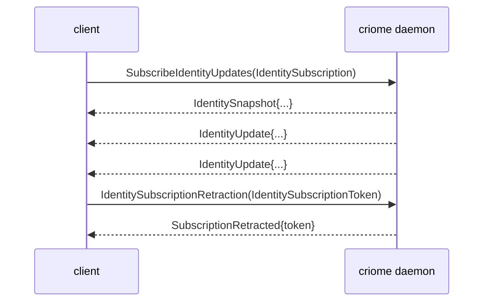

# signal-criome — architecture

*Signal contract for Criome's Spartan BLS authentication and
attestation substrate. Pure wire vocabulary; no daemon, no key
custody, no redb tables, no actors, no sockets.*

## 0 · TL;DR

`signal-criome` defines the typed records Persona, Lojix, Forge,
ClaviFaber feeds, and other Criome clients send to the `criome`
daemon. Identity registration, signature envelopes, attestations,
verification replies, archive attestation, channel-grant
attestation, authorization attestation, and Criome-routed
authorization of exact Signal request digests. One bidirectional
channel declared with `signal_channel!` in `src/lib.rs`.

Subscription close on the identity-updates stream follows the
canonical lifecycle named in `~/primary/skills/subscription-lifecycle.md`:
a typed request-side `Retract IdentitySubscriptionRetraction` carries
the per-stream `IdentitySubscriptionToken`; the daemon responds with
`CriomeReply::SubscriptionRetracted` echoing the token. The kernel
grammar at `signal-core/macros/src/validate.rs:303–331` enforces the
close-is-Retract shape.

## 1 · Channel

| Side | Component |
|---|---|
| Request side | Persona, Lojix, Forge, ClaviFaber feeds, or future Criome clients. |
| Reply / event side | `criome` daemon |

Criome verifies and records cryptographic authority. Persona decides
and acts. Attestations are separate records that reference content
by typed digest and purpose; content records do not grow proof
fields.

`signal-criome` deliberately avoids the name `AuthProof`. The
contract uses specific records: `SignatureEnvelope`, `SignedObject`,
`VerificationReceipt`, `DelegationGrant`, `ComponentRelease`,
`SignedPersonaRequest`, `SignalCallAuthorization`, and
`AuthorizationGrant`.

## 2 · Messages

```text
CriomeRequest                             CriomeReply
├─ Sign                                   ├─ SignReceipt
├─ VerifyAttestation                      ├─ VerificationResult
├─ RegisterIdentity                       ├─ IdentityReceipt
├─ RevokeIdentity                         ├─ IdentitySnapshot
├─ LookupIdentity                         ├─ AttestationReceipt
├─ AttestArchive                          ├─ AuthorizationPending
├─ AttestChannelGrant                     ├─ AuthorizationGranted
├─ AttestAuthorization                    ├─ AuthorizationDenied
├─ AuthorizeSignalCall                    ├─ AuthorizationExpired
├─ ObserveAuthorization                   ├─ AuthorizationUnavailable
├─ VerifyAuthorization                    ├─ AuthorizationObservationSnapshot
├─ RouteSignatureRequest                  ├─ SignatureRouteReceipt
├─ SubmitSignature                        ├─ SignatureSubmissionReceipt
├─ RejectAuthorization                    ├─ AuthorizationObservationRetracted
├─ SubscribeIdentityUpdates               ├─ SubscriptionRetracted
├─ IdentitySubscriptionRetraction(token)  └─ Rejection
└─ AuthorizationObservationRetraction(token)

CriomeEvent
├─ IdentityUpdate         (on IdentityUpdateStream)
└─ AuthorizationUpdate    (on AuthorizationObservationStream)
```

### Routed authorization relation

The Lojix integration uses Criome as the authorization topology:
`lojix-daemon` submits the exact canonical `signal-lojix` request
digest to its local `criome-daemon`. Criome routes signature
solicitations to the relevant signing clients or Criome peers, records
the resulting signatures, and returns one of:

- `AuthorizationPending` — signature work exists and can be observed.
- `AuthorizationGranted` — an `AuthorizationGrant` names the exact
  request digest, contract, root verb, scope, signature result,
  signatures, issuer, and expiry.
- `AuthorizationDenied`, `AuthorizationExpired`, or
  `AuthorizationUnavailable` — closed terminal or temporary outcomes.

`AuthorizationGrant` is the permission surface: permission comes from
signatures over the exact request. Lojix consumes only the envelope
and verifies that it names the exact request digest it is about to
execute.

`tui-criome` is the expected stateful signing client. It owns a local
Sema database for request history and key material, speaks this
contract to `criome-daemon`, receives signature solicitations, submits
signatures, and can create signed requests for Criome to route.

### Current authorization model

- This contract is published as the public GitHub repository
  `LiGoldragon/signal-criome`.
- The authorized object is the exact canonical Signal request digest.
- Authorization permission comes from signatures over that digest.
- The contract vocabulary is signature-solicitation shaped:
  `AuthorizeSignalCall` starts the authorization relation,
  `RouteSignatureRequest` presents work to a signing surface,
  `SubmitSignature` and `RejectAuthorization` close a signer decision,
  and `ObserveAuthorization` pushes pending/granted/denied state.
- `signal-criome` does not model daemon-owned permission slots,
  local ACL grants, or an in-band proof gate. The durable authority
  object is the signed authorization envelope over the exact request.
- `tui-criome` is a stateful signing client of this contract. It owns
  local request history, signing decisions, and signing-client key
  material in its own Sema database; it can receive signature
  requests and create signed requests for Criome.

Authorization observation follows the same subscription discipline as
identity updates: `ObserveAuthorization` opens
`AuthorizationObservationStream`; `AuthorizationObservationRetraction`
is the request-side `Retract` close carrying the stream token; the
reply-side `AuthorizationObservationRetracted` echoes the token.

Closed enums only. No `Unknown` variant on the wire; positive
rejection causes (`UnknownSigner`, `UnknownIdentity`) name specific
domain failures, not lifecycle placeholders.

### Path A lifecycle on the identity-updates stream



The request retract variant is required by the `signal_channel!`
stream-block grammar; the reply ack is the final event consumers
bind their in-flight subscribe to. Raw socket close is not semantic
protocol.

### Signal Root Verbs

Every `CriomeRequest` variant declares its root verb in the
`signal_channel!` declaration. `signal-core` generates
`CriomeRequest::signal_verb()` and `CriomeRequest::into_signal_request()`
from that declaration.

```text
Sign                              -> Assert
VerifyAttestation                 -> Validate
RegisterIdentity                  -> Assert
RevokeIdentity                    -> Retract
LookupIdentity                    -> Match
AttestArchive                     -> Assert
AttestChannelGrant                -> Assert
AttestAuthorization               -> Assert
AuthorizeSignalCall               -> Assert
ObserveAuthorization              -> Subscribe   (opens AuthorizationObservationStream)
VerifyAuthorization               -> Validate
RouteSignatureRequest             -> Assert
SubmitSignature                   -> Assert
RejectAuthorization               -> Assert
SubscribeIdentityUpdates          -> Subscribe   (opens IdentityUpdateStream)
IdentitySubscriptionRetraction    -> Retract     (closes IdentityUpdateStream)
AuthorizationObservationRetraction -> Retract    (closes AuthorizationObservationStream)
```

## 3 · Closed-enum integrity

Wire enums in this crate are closed. The "Unknown*" record names
that appear name **positive** "entity not in our registry"
rejections, not lifecycle uncertainty placeholders:

```text
VerificationDecision
  | Valid
  | InvalidSignature
  | UnknownSigner          -- positive rejection: "the signer id is not in our registry"
  | Expired
  | Revoked
  | ReplayAttempted

RejectionReason
  | MalformedRequest
  | UnsupportedSignatureScheme
  | UnknownIdentity        -- positive rejection: "the identity is not in our registry"
  | RevokedIdentity
  | DuplicateIdentity
  | ReplayAttempted

ContentPurpose
  | SignedObject
  | ComponentRelease
  | ChannelGrant
  | ChannelRetract
  | Authorization
  | Archive
  | PrivilegeElevation

Identity
  | Persona(PrincipalName)
  | Agent(PrincipalName)
  | Host(PrincipalName)
  | Developer(PrincipalName)
  | Cluster(PrincipalName)
```

`UnknownSigner` and `UnknownIdentity` are domain answers, not
polling-shape escape hatches. A consumer that sees one of them does
not retry the same query expecting a different answer; it acts on the
closed observation.

## 4 · Domain Separation

Every signed payload binds an `ObjectDigest` to a `ContentPurpose`,
`Identity`, `AuditContext`, and optional expiry. Detached signatures
over raw bytes are not modeled by this contract.

## 5 · Bootstrap Convention

Consumers discover Criome's root public key at `/etc/criome/root.pub`
in deployed systems. Test runners may override that path with an
explicit environment variable, but the contract's vocabulary treats
the root key as a registered public key, not as a hard-coded global.

## 6 · Constraints

| Constraint | Witness |
|---|---|
| Every request/reply travels as a Signal frame. | `tests/round_trip.rs` length-prefixed frame tests per variant. |
| Every `CriomeRequest` variant declares a Signal root verb. | `signal-core` generates `CriomeRequest::signal_verb()`; round-trip tests assert each variant's expected root. |
| Subscription close uses Path A: request-side `Retract IdentitySubscriptionRetraction` carrying the token, plus reply-side `SubscriptionRetracted` ack echoing the token. | The `signal_channel!` declaration names `Retract IdentitySubscriptionRetraction(IdentitySubscriptionToken)` and a `stream IdentityUpdateStream { close IdentitySubscriptionRetraction; … }` block. The kernel grammar (`signal-core::macros::validate`) rejects a `stream` block whose `close` is not a request-side `Retract` variant. Wire witnesses cover the retract request and the reply ack. |
| Wire enums contain no `Unknown` variant. | Source scan: `UnknownSigner` and `UnknownIdentity` are *closed positive rejection causes*, not lifecycle uncertainty placeholders (see "Closed-enum integrity" above). Every closed enum is exhaustively matched in `tests/round_trip.rs`. |
| Any record name containing the word `Unknown` represents a positive "entity not in our state" rejection, not a polling-shape escape hatch. | `VerificationDecision::UnknownSigner` and `RejectionReason::UnknownIdentity` are domain rejection vectors describing "the entity you named is not in our registry"; they are closed, positive failure modes. |
| BLS-only signature scheme vocabulary. | `tests/round_trip.rs` asserts the signature-scheme vocabulary is BLS only. |
| No `AuthProof` naming. | Source-scan witness in `tests/round_trip.rs` rejects an `AuthProof` symbol. |
| No runtime, daemon, or storage dependencies. | `tests/round_trip.rs` asserts the absence of Kameo, Tokio, socket, redb, and Sema storage imports. |
| Every `signal_channel!` request variant has a typed `signal_verb()` mapping. | Generated by the macro; round-trip witness asserts each variant. |
| Round-trip witnesses cover every variant in rkyv. | `tests/round_trip.rs` covers every request, reply, and event variant. |
| Round-trip witnesses cover every variant in NOTA. | `examples/canonical.nota` holds one canonical text example per request/reply/event variant; round-trip tests parse and re-emit each. |
| Routed authorization names the exact Signal request digest being authorized. | `SignalCallAuthorization`, `AuthorizationVerification`, `AuthorizationGrant`, and `AuthorizationStateRecord` all carry the typed `ObjectDigest`; round-trip tests cover the request, grant, verification, pending state, and event forms. |
| Authorization grants derive permission from signatures. | `AuthorizationGrant` carries scope, signature result, and signatures; permission comes from signatures over the exact request. |
| Authorization observation uses Path A stream close. | The `signal_channel!` declaration names `Retract AuthorizationObservationRetraction(AuthorizationObservationToken)` and the `AuthorizationObservationStream` close block; round-trip witnesses cover the retract request and `AuthorizationObservationRetracted` reply. |
| No stringly-typed dispatch (`match s.as_str()`) for closed-set states. | All decision / reason / purpose / identity fields are typed closed enums (custom `Identity` codec dispatches on a closed head-name set). |
| Contract crate dependencies use a named API reference (branch or tag), not a raw revision pin. | `Cargo.toml` review: `signal-core` is declared `git = "..."` with a named-branch shape; raw `rev = "..."` pins are not used. |

## 7 · NOTA codec quirk on `signal_channel!` payload heads

The `signal_channel!` macro emits a request variant's NOTA head as
the **payload's record head**, not the Rust variant name. For
example, `CriomeRequest::IdentitySubscriptionRetraction(IdentitySubscriptionToken { .. })`
encodes as `(IdentitySubscriptionToken (...))`, not
`(IdentitySubscriptionRetraction ...)`. The `Identity` enum is the
exception — it has a hand-written NOTA codec dispatching on a closed
head-name set (`Persona` / `Agent` / `Host` / `Developer` / `Cluster`)
because the head IS the typed payload, not a wrapper.

## 8 · Versioning

`signal_core::Frame` carries the protocol version. Schema-level
changes are breaking; coordinate the `criome` daemon and every
consumer on the upgrade.

This crate depends on `signal-core` via a named-branch reference,
not a raw revision pin. The destination is a stable `signal-core`
API branch/bookmark once that lane is declared.

## 9 · Non-Ownership

- No daemon.
- No actor runtime.
- No socket or CLI.
- No redb or Sema tables.
- No private-key storage.
- No prompt audit or policy engine.
- No embedded proof fields in Persona content contracts.

## 10 · Code map

```text
src/
└── lib.rs                — payloads + signal_channel! invocation
examples/
└── canonical.nota         — one canonical example per request/reply/event variant
tests/
├── canonical_examples.rs  — canonical NOTA examples parser
└── round_trip.rs          — per-variant frame round trips + NOTA witnesses
                             + closed-enum + verb-mapping witnesses
                             + AuthProof + runtime-dependency absence witnesses
                             + full subscribe/event/retract/ack lifecycle witness
```

## See also

- `~/primary/skills/contract-repo.md` — contract-repo discipline.
- `~/primary/skills/subscription-lifecycle.md` — the canonical
  subscription FSM the identity-updates stream implements.
- `signal-core/src/channel.rs` — the macro and stream-block grammar
  that enforces the request-side retract variant.
- `signal-persona-system/ARCHITECTURE.md`,
  `signal-persona-harness/ARCHITECTURE.md`, and
  `signal-persona-terminal/ARCHITECTURE.md` — sibling contracts
  using the same Path A subscription discipline.
