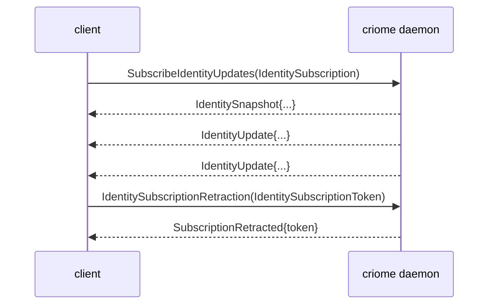

# signal-criome — architecture

*Signal contract for Criome's Spartan BLS authentication and
attestation substrate. Pure wire vocabulary; no daemon, no key
custody, no storage tables, no actors, no sockets.*

## 0 · TL;DR

`signal-criome` defines the typed records Persona, Lojix, Forge,
ClaviFaber feeds, and other Criome clients send to the `criome`
daemon. Identity registration, signature envelopes, attestations,
verification replies, archive attestation, channel-grant
attestation, authorization attestation, and Criome-routed
authorization of exact Signal request digests. One bidirectional
channel declared with `signal_channel!` in `src/lib.rs`.

## Migration history — three-layer model

This contract now uses the three-layer model affirmed 2026-05-20 per
`primary/reports/designer/246-v4-bundled-fix-deep-design-with-examples.md`
and `primary/reports/designer/248-three-layer-changes-for-operators.md`.

**Layer 1 — Contract operations on the wire (this crate).** The old
`SignalVerb` wrappers are gone. The payload enum itself is the
operation list, and each variant is a contract-local root such as
`Sign`, `VerifyAttestation`, `RegisterIdentity`,
`AuthorizeSignalCall`, `ObserveAuthorization`,
`RouteSignatureRequest`, `SubmitSignature`, or
`RejectAuthorization`.

**Subscription observability.** Criome is *not* a persona component;
the mandatory `Tap`/`Untap` observable block does not apply. The
existing identity-updates and authorization-observation subscriptions
stay as domain-specific open and close operations.

**Layer 2 — Component Commands (daemon crate).** Criome's daemon
owns its typed Command enum (e.g. `CriomeCommand::AssertAttestation`,
`CriomeCommand::RecordSignature`, `CriomeCommand::ReadIdentity`)
plus a `CommandExecutor` that knows criome's tables. Lowering from
contract operation to command happens in the daemon, not in this
contract crate.

**Layer 3 — Sema classification (signal-sema).** Each Component
Command projects to a payloadless `SemaOperation` class label via
`ToSemaOperation`, so observers can filter cross-component activity.
Criome does not import payload-bearing Sema variants; classification
is observation-only.

**Frame layer.** This crate depends on `signal-frame` (frame envelope,
exchange identifiers, handshake, and the `signal_channel!` macro), not
deprecated `signal-core`.

`signal-criome` still has a broad single channel spanning three
relations: consumer ↔ criome, criome-peer ↔ criome-peer, and
subscriber ↔ criome. Splitting those into multiple contract channels
is a future design question, not part of the wire-kernel migration.

References:
- `primary/reports/designer/246-v4-bundled-fix-deep-design-with-examples.md`
- `primary/reports/designer/248-three-layer-changes-for-operators.md`
- `primary/skills/component-triad.md` §"Verbs come in three layers"
- `primary/skills/contract-repo.md` §"Public contracts use contract-local operation verbs"

Subscription close on the identity-updates stream follows the
canonical lifecycle named in `~/primary/skills/subscription-lifecycle.md`:
a typed request-side `IdentitySubscriptionRetraction` carries the
per-stream `IdentitySubscriptionToken`; the daemon responds with
`CriomeReply::SubscriptionRetracted` echoing the token. The
`signal-frame` macro grammar binds the close operation to the stream.

## 1 · Channel

| Side | Component |
|---|---|
| Request side | Two classes of client. **Consumers** (Lojix, Persona components, Forge, ClaviFaber feeds — anything asking *"is this allowed?"* and trusting the answer). **Peer criome daemons** (cross-criome signature-solicitation routing for quorum policies). |
| Reply / event side | `criome` daemon |

`signal-criome` is **not** the surface for owner-class operations on
the daemon itself (passphrase submission, master-key operations,
policy mutation, peer-routing table mutation, escalation-approval
replies). Those live on the separate `owner-signal-criome` contract
between the daemon's single Unix-user owner and the daemon. See
`criome/ARCHITECTURE.md` §"Security model — Unix-user as boundary"
for the discipline.

Criome verifies and records cryptographic authority. Persona decides
and acts. Attestations are separate records that reference content
by typed digest and purpose; content records do not grow proof
fields.

`signal-criome` deliberately avoids the name `AuthProof`. The
contract uses specific records: `SignatureEnvelope`, `SignedObject`,
`VerificationReceipt`, `DelegationGrant`, `ComponentRelease`,
`SignedPersonaRequest`, `SignalCallAuthorization`, and
`AuthorizationGrant`.

## 2 · Messages

```text
CriomeRequest                             CriomeReply
├─ Sign                                   ├─ SignReceipt
├─ VerifyAttestation                      ├─ VerificationResult
├─ RegisterIdentity                       ├─ IdentityReceipt
├─ RevokeIdentity                         ├─ IdentitySnapshot
├─ LookupIdentity                         ├─ AttestationReceipt
├─ AttestArchive                          ├─ AuthorizationPending
├─ AttestChannelGrant                     ├─ AuthorizationGranted
├─ AttestAuthorization                    ├─ AuthorizationDenied
├─ AuthorizeSignalCall                    ├─ AuthorizationExpired
├─ ObserveAuthorization                   ├─ AuthorizationUnavailable
├─ VerifyAuthorization                    ├─ AuthorizationObservationSnapshot
├─ RouteSignatureRequest                  ├─ SignatureRouteReceipt
├─ SubmitSignature                        ├─ SignatureSubmissionReceipt
├─ RejectAuthorization                    ├─ AuthorizationObservationRetracted
├─ SubscribeIdentityUpdates               ├─ SubscriptionRetracted
├─ IdentitySubscriptionRetraction(token)  └─ Rejection
└─ AuthorizationObservationRetraction(token)

CriomeEvent
├─ IdentityUpdate         (on IdentityUpdateStream)
└─ AuthorizationUpdate    (on AuthorizationObservationStream)
```

### Routed authorization relation

The Lojix integration uses Criome as the authorization topology:
`lojix-daemon` submits the exact canonical `signal-lojix` request
digest to its local `criome-daemon`. Criome routes signature
solicitations to the relevant signing clients or Criome peers, records
the resulting signatures, and returns one of:

- `AuthorizationPending` — signature work exists and can be observed.
- `AuthorizationGranted` — an `AuthorizationGrant` names the exact
  authorization request slot, request digest, contract, operation head,
  scope, signature result, signatures, issuer, and expiry.
- `AuthorizationDenied`, `AuthorizationExpired`, or
  `AuthorizationUnavailable` — closed terminal or temporary outcomes.

`AuthorizationGrant` is the permission surface visible to consumers:
permission is constituted by *signatures over the exact request
digest that satisfy criome's policy*. Lojix consumes only the
envelope and verifies that it names the exact request digest it is
about to execute. The policy that says *which signatures count* is
held in criome's owned state (see `criome/ARCHITECTURE.md`
§"Authorization model").

The `RouteSignatureRequest` / `SubmitSignature` /
`RejectAuthorization` operations travel on this contract between criome
daemons (peer routing for quorum policies). The route from criome to
its own Unix-user owner — *"may I sign this with my master key?"* —
is **not** on this contract; it is on `owner-signal-criome` as an
escalation-to-approve prompt.

### Current authorization model

- This contract is published as the public GitHub repository
  `LiGoldragon/signal-criome`.
- The authorized object is the exact canonical Signal request digest.
- Authorization permission is constituted by signatures over that
  digest *that satisfy criome's policy*. Policy alone does not
  grant; signatures alone are not enough without policy that names
  them as sufficient. Criome's policy lives in criome's owned state
  (see `criome/ARCHITECTURE.md` §"Owned"); this contract is the
  wire vocabulary that surfaces the *outcomes* of policy plus
  signatures to consumers, and the *solicitation traffic* between
  peer criome daemons.
- The contract vocabulary is signature-solicitation shaped:
  `AuthorizeSignalCall` starts the authorization relation,
  `RouteSignatureRequest` presents work to a peer criome daemon,
  `SubmitSignature` and `RejectAuthorization` close a peer's
  decision, and `ObserveAuthorization` pushes pending/granted/denied
  state.
- `signal-criome` does **not** carry owner-class operations on
  criome itself (master-key passphrase, policy mutation, peer-route
  mutation, escalation-approval prompts and replies). Those live on
  the separate `owner-signal-criome` contract.
- `tui-criome` and the `criome` CLI are **owner clients of their
  own criome daemon over `owner-signal-criome`**, not signing
  clients of this contract. The TUI exists to host long-running
  escalation-to-approve flows; the CLI handles one-shot owner
  operations.

Authorization observation follows the same subscription discipline as
identity updates: `ObserveAuthorization` opens
`AuthorizationObservationStream`; `AuthorizationObservationRetraction`
is the request-side close carrying the stream token; the
reply-side `AuthorizationObservationRetracted` echoes the token.

Closed enums only. No `Unknown` variant on the wire; positive
rejection causes (`UnknownSigner`, `UnknownIdentity`) name specific
domain failures, not lifecycle placeholders.

### Path A lifecycle on the identity-updates stream



The request retract variant is required by the `signal_channel!`
stream-block grammar; the reply ack is the final event consumers
bind their in-flight subscribe to. Raw socket close is not semantic
protocol.

### Sema classification projections (Layer 3)

Once migrated, each daemon-side Component Command will project to one
of the six payloadless Sema classes via `ToSemaOperation`. The
projection below shows the *expected classification* of each
contract operation's lowered command — used only for observation, not
on the wire.

```text
Sign                              -> Assert        (records a signature)
Verify                            -> Validate      (dry-run integrity check)
Register                          -> Assert        (records new identity)
Revoke                            -> Retract       (tombstones identity)
Lookup                            -> Match         (read identity table)
AttestArchive                     -> Assert
AttestChannelGrant                -> Assert
AttestAuthorization               -> Assert
Authorize                         -> Assert        (records authorization)
Observe                           -> Subscribe     (opens AuthorizationObservationStream)
RouteSignatureRequest             -> Assert
SubmitSignature                   -> Assert
RejectAuthorization               -> Assert
SubscribeIdentityUpdates          -> Subscribe     (opens IdentityUpdateStream)
IdentitySubscriptionRetraction    -> Retract       (closes IdentityUpdateStream)
AuthorizationObservationRetraction -> Retract      (closes AuthorizationObservationStream)
```

The wire form carries the contract-local operation head (`Sign`,
`RegisterIdentity`, `RevokeIdentity`, etc.); the Sema class label is
computed at observation publish time inside the daemon, not encoded
into the request.

## 3 · Closed-enum integrity

Wire enums in this crate are closed. The "Unknown*" record names
that appear name **positive** "entity not in our registry"
rejections, not lifecycle uncertainty placeholders:

```text
VerificationDecision
  | Valid
  | InvalidSignature
  | UnknownSigner          -- positive rejection: "the signer id is not in our registry"
  | Expired
  | Revoked
  | ReplayAttempted

RejectionReason
  | MalformedRequest
  | UnsupportedSignatureScheme
  | UnknownIdentity        -- positive rejection: "the identity is not in our registry"
  | RevokedIdentity
  | DuplicateIdentity
  | ReplayAttempted

ContentPurpose
  | SignedObject
  | ComponentRelease
  | ChannelGrant
  | ChannelRetract
  | Authorization
  | Archive
  | PrivilegeElevation

Identity
  | Persona(PrincipalName)
  | Agent(PrincipalName)
  | Host(PrincipalName)
  | Developer(PrincipalName)
  | Cluster(PrincipalName)
```

`UnknownSigner` and `UnknownIdentity` are domain answers, not
polling-shape escape hatches. A consumer that sees one of them does
not retry the same query expecting a different answer; it acts on the
closed observation.

## 4 · Domain Separation

Every signed payload binds an `ObjectDigest` to a `ContentPurpose`,
`Identity`, `AuditContext`, and optional expiry. Detached signatures
over raw bytes are not modeled by this contract.

## 5 · Bootstrap Convention

Consumers discover their local Criome's master public key at a known
per-user path (typically under the per-user runtime directory),
mirrored at a stable filesystem location for early-boot consumers.
Test runners may override the path with an explicit environment
variable. The contract's vocabulary treats the master key as a
registered public key, not as a hard-coded global — there are many
criome daemons (one per Unix-user trust boundary), so "the" root
key is per-daemon, not a singleton.

### 5.1 Peer discovery (predictable socket names)

Peer criome daemons (cross-criome solicitation for quorum policies)
are found by predictable socket names of the form:

```text
${PER_USER_RUNTIME_DIR}/criome/<short-hash-of-master-pubkey>.sock
```

The short hash is for ergonomics; signature verification at the
requester remains the authoritative check, so socket-name
collisions are inconvenient (the routing layer disambiguates) but
not dangerous.

**Cross-host transport is an open design slot.** Local Unix sockets
do not cross hosts; quorum policies that name peers on other hosts
need a wire-crypto layer (TLS, signed envelopes, or SSH tunnelling).
The choice is deferred to a follow-up designer report. See
`criome/ARCHITECTURE.md` §6.1.

## 6 · Constraints

| Constraint | Witness |
|---|---|
| Every request/reply travels as a Signal frame. | `tests/round_trip.rs` length-prefixed frame tests per variant. |
| Every `CriomeRequest` variant is a contract-local operation in verb form. | round-trip tests assert each variant's contract-local name; no `SignalVerb` tag appears on the wire. |
| Subscription close uses Path A: request-side `IdentitySubscriptionRetraction` carrying the token, plus reply-side `SubscriptionRetracted` ack echoing the token. | The `signal_channel!` declaration names `IdentitySubscriptionRetraction(IdentitySubscriptionToken)` and binds it to `IdentityUpdateStream`. Wire witnesses cover the close request and the reply ack. |
| Wire enums contain no `Unknown` variant. | Source scan: `UnknownSigner` and `UnknownIdentity` are *closed positive rejection causes*, not lifecycle uncertainty placeholders (see "Closed-enum integrity" above). Every closed enum is exhaustively matched in `tests/round_trip.rs`. |
| Any record name containing the word `Unknown` represents a positive "entity not in our state" rejection, not a polling-shape escape hatch. | `VerificationDecision::UnknownSigner` and `RejectionReason::UnknownIdentity` are domain rejection vectors describing "the entity you named is not in our registry"; they are closed, positive failure modes. |
| BLS-only signature scheme vocabulary. | `tests/round_trip.rs` asserts the signature-scheme vocabulary is BLS only. |
| No `AuthProof` naming. | Source-scan witness in `tests/round_trip.rs` rejects an `AuthProof` symbol. |
| No runtime, daemon, or storage dependencies. | `tests/round_trip.rs` asserts the absence of Kameo, Tokio, socket, redb, and Sema storage imports. |
| Each variant's record head matches the contract-local verb declared in `signal_channel!`. | Generated by the macro; round-trip witness asserts each variant's NOTA head. |
| Round-trip witnesses cover every variant in rkyv. | `tests/round_trip.rs` covers every request, reply, and event variant. |
| Round-trip witnesses cover every variant in NOTA. | `examples/canonical.nota` holds one canonical text example per request/reply/event variant; round-trip tests parse and re-emit each. |
| Routed authorization names the exact Signal request digest being authorized. | `SignalCallAuthorization`, `AuthorizationVerification`, `AuthorizationGrant`, and `AuthorizationStateRecord` all carry the typed `ObjectDigest`; round-trip tests cover the request, grant, verification, pending state, and event forms. |
| Authorization grants carry the durable request identity. | `AuthorizationGrant` carries `AuthorizationRequestSlot`, so verification and denial paths do not mint or derive a slot from a digest. |
| Authorization is constituted by signatures-over-the-exact-digest that satisfy criome's policy. | `AuthorizationGrant` carries scope, the signatures collected, and `AuthorizationPolicySatisfaction` with the policy class, required signature threshold, and satisfied signers (per the policy criome holds in its own state — see `criome/ARCHITECTURE.md` §"Owned"). |
| `signal-criome` carries no owner-class operations. | Source scan: no `SubmitPassphrase`, no `RegisterPolicy`, no `RegisterPeer`, no `RequestOwnerApproval`, no `OwnerApprovalReply`. Those variants live (or will live) on `owner-signal-criome` only. |
| Authorization observation uses Path A stream close. | The `signal_channel!` declaration names `AuthorizationObservationRetraction(AuthorizationObservationToken)` and binds it to `AuthorizationObservationStream`; round-trip witnesses cover the close request and `AuthorizationObservationRetracted` reply. |
| No stringly-typed dispatch (`match s.as_str()`) for closed-set states. | All decision / reason / purpose / identity fields are typed closed enums (custom `Identity` codec dispatches on a closed head-name set). |
| Contract crate dependencies use a named API reference (branch or tag), not a raw revision pin. | `Cargo.toml` review: `signal-frame` (and any other contract dependencies) are declared `git = "..."` with a named-branch shape; raw `rev = "..."` pins are not used. |

## 7 · NOTA codec quirk on `signal_channel!` payload heads

The `signal_channel!` macro emits a request variant's NOTA head as
the **payload's record head**, not the Rust variant name. For
example, `CriomeRequest::IdentitySubscriptionRetraction(IdentitySubscriptionToken { .. })`
encodes as `(IdentitySubscriptionToken (...))`, not
`(IdentitySubscriptionRetraction ...)`. The `Identity` enum is the
exception — it has a hand-written NOTA codec dispatching on a closed
head-name set (`Persona` / `Agent` / `Host` / `Developer` / `Cluster`)
because the head IS the typed payload, not a wrapper.

## 8 · Versioning

`signal_frame::Frame` carries the protocol version. Schema-level
changes are breaking; coordinate the `criome` daemon and every
consumer on the upgrade.

This crate depends on `signal-frame` via a named-branch reference,
not a raw revision pin. The destination is a stable `signal-frame`
API branch/bookmark once that lane is declared.

## 9 · Non-Ownership

- No daemon.
- No actor runtime.
- No socket or CLI.
- No storage or Sema tables.
- No private-key storage.
- No prompt audit or policy engine.
- No embedded proof fields in Persona content contracts.
- **No owner-class operations** — passphrase submission, master-key
  generation/rotation, policy mutation, peer-route mutation, and
  escalation-to-approve prompts/replies all live on the separate
  `owner-signal-criome` contract.

## 10 · Code map

```text
src/
└── lib.rs                — payloads + signal_channel! invocation
examples/
└── canonical.nota         — one canonical example per request/reply/event variant
tests/
├── canonical_examples.rs  — canonical NOTA examples parser
└── round_trip.rs          — per-variant frame round trips + NOTA witnesses
                             + closed-enum + operation-head witnesses
                             + AuthProof + runtime-dependency absence witnesses
                             + full subscribe/event/retract/ack lifecycle witness
```

## Pending schema-engine upgrade

**Status:** scheduled for migration to schema-language-based contract per `reports/designer/326-v13-spirit-complete-schema-vision.md` + `reports/designer/324-migration-mvp-spirit-handover-re-specification.md`.

**Target:** this contract's hand-written `signal_channel!` invocation converts to a single `criome/criome.schema` file (shared with the `criome` daemon's repository). The brilliant macro library (`primary-ezqx.1`) reads the schema + emits this crate's wire types + ShortHeader projection + dispatcher binding + VersionProjection impls + the subscribe/event/retract/ack lifecycle scaffolding.

**Sequence:** Spirit is the MVP pilot landing first via `primary-ezqx.1`; criome's contract follows after pilot succeeds and after schema-language stream-block syntax stabilises (criome's identity-updates stream is the canonical Path A subscription consumer and exercises the lifecycle the schema must encode).

**Per-component concerns:** The Path A subscription FSM (subscribe/event/retract/ack) is the most schema-mechanically-complex feature in this contract. The schema-language stream-block syntax per `/326-v13` must encode this lifecycle round-trippably; cutover only after the schema reader supports the full Path A grammar.

**References:**
- `reports/designer/326-v13-spirit-complete-schema-vision.md` — uniform header form + schema-language design
- `reports/designer/324-migration-mvp-spirit-handover-re-specification.md` — migration MVP + handover state
- `reports/designer/322-spirit-mvp-positional-schema-worked-example.md` — Spirit MVP worked example
- `reports/operator/174-schema-import-header-design-critique-2026-05-24.md` — header/body/feature separation + lowering rules

## See also

- `~/primary/skills/contract-repo.md` — contract-repo discipline.
- `~/primary/skills/component-triad.md` §"Verbs come in three layers".
- `~/primary/skills/subscription-lifecycle.md` — the canonical
  subscription FSM the identity-updates stream implements.
- `signal-frame/macros/src/validate.rs` — the macro and stream-block
  grammar that enforces the request-side retract variant.
- `signal-persona-system/ARCHITECTURE.md`,
  `signal-persona-harness/ARCHITECTURE.md`, and
  `signal-persona-terminal/ARCHITECTURE.md` — sibling contracts
  using the same Path A subscription discipline.
